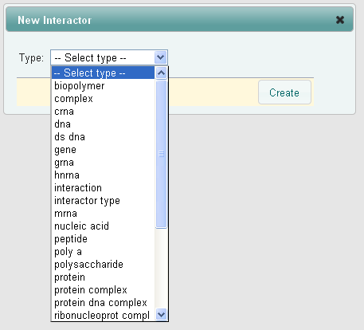
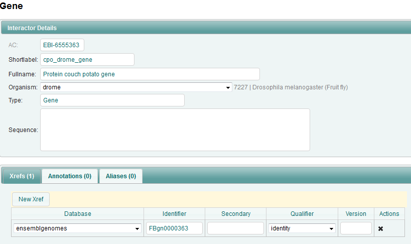

# 9. Creating a new interactor

Go to Main → New → Interactor

Select the interactor type from the pulldown menu, then ‘Create’.

If your molecule is a peptide, do you need to create this as a new entry, or can it be mapped to part of an existing protein in UniProtKB? **BLAST** your sequence to find out if this is the case. If it corresponds to a partial sequence from an existing protein of the correct species, use the canonical protein as your participant and add a Feature \(type = Sufficient to Bind\) with the range corresponding to your peptide sequence.

## 9.1. Protein

A new protein interactor is required when either:

1. The protein is synthetic and does not have a biological equivalent with a UniProtKB accession number assigned to it.

2. The protein is a chimeric protein which cannot be described adequately within the feature editor. Such a chimeric protein may be made up of two \(or more\) peptides from different gene products or species which interacts with other proteins or peptides \(for further info regarding relevance see below\).

3. The protein does not have an available sequence at present, such as a protein recognised by an antibody specific for a homologous protein or a protein from a proprietary database where the sequence is not available. Add a comment “similar to UniProt P9999”.

4. The protein has a sequence available in another database but does not have a UniProtKB entry \(this rarely occurs – only use if blasting a protein does not give any UniProt matches &gt;98% identity with full sequence match.\) An Xref should be added – qualifier = identity – for the non-UniProt entry.

### 9.1.1 Short Label

The short label should, wherever possible, use the protein name of a homologous protein \(ortholog or paralog\), followed by \_organism name and \_protein or \_peptide as the case may be.

Examples:

EBI-1563412 loc653596\_human\_protein

EBI-6868540 s10aa\_chlae\_protein

In cases where this is not possible, for example the peptide is synthetic with no biological counterpart having a UniProtKB accession number, the identifier used by the author of the paper should be used as the short label, followed by underscore peptide ‘\_peptide’. As a last resort, an identifier consisting of the word pep and the first 17 amino acid single letter code characters should be used. In the latter case the short label should take the form: pep your amino acid sequence \(lowercase\).

### 9.1.2 Source

The source of the protein should be selected from the drop down list. It should always be a species **not** a tissue or cell type organism. If the source organism of the peptide or protein is not within the drop down list, a new BioSource entry must be made for it. If a peptide has multiple biological sources \(an identical peptide is a conserved protein in several organisms\), the peptide should be matched to the species of the other interactor\(s\) in the assay and the appropriate entry created.

#### 9.1.2.1 Chemical synthesis

The peptide has been synthesised through a series of physical and chemical manipulations usually involving one or more chemical reactions _in vitro._ The “expressed in” for this peptide on the interaction will be chemical synthesis.

#### 9.1.2.2 Chimeric protein/Fusion protein

The peptide or protein has been produced by a splicing together of two or more complete or partial DNA or protein sequences to produce a chimeric or mosaic protein. In cases where a newly created protein \(fusion protein/chimera\) has biological properties and participates in the interaction, create a new entry using the protein editor with the sequence of the fusion protein. If possible, the UniProtKB accessions of the two proteins should be added in with the cross-reference qualifier ‘multiple-parent’. Example: [EBI-1264950](about:blank) in table below

If the proteins are naturally occurring fusion proteins do **NOT** create a new protein: see section 6.1.1.3 earlier e.g. BCR-ABL –‘Identification of Naturally occurring fusion Proteins’.

Interactions involving fusion proteins that are of NO biological relevance need NOT be curated. For example, PMID: 22939624, a chimeric kinase construct in which one loop region/N-lobe was fused into another molecule or cases in which domains reciprocally switched between molecules.

**Table of created fusion proteins**

<table>
  <thead>
    <tr>
      <th style="text-align:left">Short Name</th>
      <th style="text-align:left">Long Name</th>
      <th style="text-align:left">Species</th>
      <th style="text-align:left">Annotation</th>
      <th style="text-align:left">x-ref qualifer</th>
    </tr>
  </thead>
  <tbody>
    <tr>
      <td style="text-align:left">
        
tp53_rara_human_prot

        
EBI-1264950

      </td>
      <td style="text-align:left">p53-RAR alpha fusion protein</td>
      <td style="text-align:left">Human</td>
      <td style="text-align:left">No-uniprot-update</td>
      <td style="text-align:left">Multiple parent (UniProt P10276 and P04637)</td>
    </tr>
    <tr>
      <td style="text-align:left">
        
oct1_oat1

        
EBI-5261357

      </td>
      <td style="text-align:left">Oct1 Oat1 fusion protein</td>
      <td style="text-align:left">Rat</td>
      <td style="text-align:left">No-uniprot-update</td>
      <td style="text-align:left">Multiple parent</td>
    </tr>
    <tr>
      <td style="text-align:left">
        
Daap-4

        
EBI-2912160

      </td>
      <td style="text-align:left">Human fusion protein: Ig2 and Ig3 domains from VEGFR1, and Tie2 aas 1-348.</td>
      <td
      style="text-align:left">Human</td>
        <td style="text-align:left">No-uniprot-update</td>
        <td style="text-align:left"></td>
    </tr>
  </tbody>
</table>

### 9.1.4 Sequence

Any novel sequences used to create a new protein interactor, which are over 20 amino acids in length, should first be analysed by InterProScan to determine if further information can be obtained about the protein sequence. This information can be entered as an InterPro cross-reference to InterPro via an InterPro accession number.

Any discrepancy between the sequence in the publication/submission and the protein in UniProtKB should be noted as a Caution comment in the annotation section \(as a sequencing error or polymorphism if this can be identified\).

**Note:** If a protein is entered via the Protein Editor and has **no accompanying sequence**, numeric **feature ranges** should not be used to describe domains, PTMs etc. even if given in the paper. Non-numeric characters “n”, “c” and “?” may be used, numeric information should be stored in a Comment until a sequence becomes available.

For example a protein may have no sequence either in UniProtKB or written out in the relevant paper, but the authors may state they have sequenced the protein and that the binding site is an SH2 domain. In such a case, the feature range will be “?-?” and the database cross reference will be IPR000980.

## 9.2 Small Molecule

Small molecules are entered directly into IntAct using ChEBI identifiers in the import tool.

If your molecule does NOT have an existing CHEBI entry, you will have to **create** one at [www.ebi.ac.uk/chebi/submissions/login](https://www.ebi.ac.uk/chebi/submissions/login). This will immediately give you a new CHEBI Identifier. You must then create a new small molecule in IntAct using the new identifier as a database Xref.

If your entry is rejected by ChEBI, you can still create a reference entity in the IntACt database \(see below\).

Whilst ChEBI prefers not to include genome-encoded peptides, as quoted on the ChEBI Homepage: ” The qualifier 'small' implies the exclusion of entities directly encoded by the genome, and thus as a rule nucleic acids, proteins and peptides derived from proteins by cleavage are not included.”, it is possible to create a ChEBI entry for very small, synthetic or modified peptides.

Examples:

| Boc-DON-Gln-Ile-Val-OMe | CHEBI:72703 |
| :--- | :--- |
| Leu-Leu-Leu | CHEBI:74541 |
| Ala-Leu-Thr-Pro | CHEBI:73292 |
| N-acetyl-L-tyrosylglycylglycine | CHEBI:388118 |
| Ac-D-Phe-His-D-Pro-NH2 | CHEBI:73016 |

To create a new small molecule in the Editor: Go to Main → New → Interactor

Select and enter the correct type of molecule from the drop-down box \(see below\).

Press Create.

## 9.3 Nucleic Acid

Nucleic acids are normally only created if a sequence is available or if an exact match for the sequence can be found in ENA or another nucleotide sequence \(INSDC - Genbank/DDJB\), a genomic database e.g. Ensembl/UCSC/NCBI or RNAcentral \(www.rnacentral.org\)

\(An exception is when you creating a “gene” for Ch-IP experiments: for example “human\_bax\_gene”; this only requires an Xref to a genomic database, preferably Ensembl\).

First, ensure your molecule is not already in the IntAct Database by searching for it in the Editor. If it is not present:

Go to Main → New → Interactor

Select and enter the correct type of molecule from the drop-down-box.

Press Create.

The shortlabel and fullname could be based on the author’s description or, for short sequences, the sequence itself can be used for nomenclature.

### 9.3.1 Examples

<table>
  <thead>
    <tr>
      <th style="text-align:left">
        
<b>Nucleic</b>
        

        
<b>Acid</b>
        

      </th>
      <th style="text-align:left"><b>Shortlabel</b>
      </th>
      <th style="text-align:left"><b>Fullname</b>
      </th>
    </tr>
  </thead>
  <tbody>
    <tr>
      <td style="text-align:left">DNA</td>
      <td style="text-align:left">pri-mir-29b2_29c_regulatory_region</td>
      <td style="text-align:left">Human pri-miR-29b2/29c Regulatory Region</td>
    </tr>
    <tr>
      <td style="text-align:left">ssdna</td>
      <td style="text-align:left">m13mp18</td>
      <td style="text-align:left">M13mp18ssDNA</td>
    </tr>
    <tr>
      <td style="text-align:left">ssdna</td>
      <td style="text-align:left">igh_mouse_dna_1.4</td>
      <td style="text-align:left">Mouse IgH lamina-associating sequence</td>
    </tr>
    <tr>
      <td style="text-align:left">GENE</td>
      <td style="text-align:left">Bax_human_gene</td>
      <td style="text-align:left">Human BAX Gene</td>
    </tr>
    <tr>
      <td style="text-align:left">tRNA</td>
      <td style="text-align:left">Trnamet</td>
      <td style="text-align:left">tRNA(Met)</td>
    </tr>
    <tr>
      <td style="text-align:left">dsDNA</td>
      <td style="text-align:left">dsdna_dcdg:dcdg</td>
      <td style="text-align:left">dsDNA_dCdG:dCdG</td>
    </tr>
  </tbody>
</table>

Simple double stranded DNA molecules can be entered as Type of Interactor = "ds dna". If a sequence is given in the publication this should be entered, as should an XRef, if possible.

If neither a sequence nor XRef are available, no entry should be made.

In most instances the sequence of the forward \(+\) strand only should be entered \(5→3\). The sequence of the reverse \(-\) \(3 →5\) strand is ASSUMED to be complementary and need not be entered.

If there is a tag e.g. Biotin, on the positive/forward strand this can be entered as in the example below \(EBI-6864408\):

**Shortlabel** = 5-prime \(or 3-prime\);

**Feature type** = type of tag;

**Range**= numerical only - no "n" or "c" terminus entries as these terms are protein specific.

If the Tag is found on the negative/reverse strand:

**Shortlabel** = 5-prime \(or 3-prime\)\_reverse\_strand;

Feature type = type of tag;

**Range**= numerical only \(see above\)

More complicated double stranded molecules will have to be created as TWO individual single DNA strands, then linked within the interaction, using the linked feature option \(create a feature for each which corresponds to the full-length of the molecule\) see example:

[http://www.ebi.ac.uk/intact/editor/interaction/EBI-6678631](http://www.ebi.ac.uk/intact/editor/interaction/EBI-6678631)

### 9.3.2 Species

If the species of origin for a Nucleic Acid is NOT stated in your publication, but you have some idea regarding its probable source, BLATTING any primer, siRNA or other sequence given may confirm this.

BLAT search as found at: [http://genome.ucsc.edu/cgi-bin/hgBlat](http://genome.ucsc.edu/cgi-bin/hgBlat)

You will need to enter a species and a sequence of &gt;20 bases. The algorithm will only tell you if the sequence entered matches the species chosen. The Blat algorithm is much, much quicker than Blast.

### 9.3.3 Sequence

This should be entered in uppercase without gaps.

### 9.3.4 Cross-references

The databases often cross-referenced are ‘embl/genbank/ddbj’, ‘ensembl’ ‘rnacentral’ and various organism databases with qualifier= ‘identity’.

## 9.4 Gene

Example of a Gene Entry

### 9.4.1 To Create a new Gene entry

Provided your gene is in an Ensembl species, entering the Ensembl gene ID into the import tool will create the entry. Note, this does not work for EnsemblGenomes.

To create a new gene, first ensure your “gene” is not already in the IntAct Database by searching for it in the Editor using the Ensembl identifier as a search term . If it is not present:

Go to Main → New → Interactor

Select and enter the correct type of molecule from the Drop-down-box \(see below\)

Press Create.

You will now have a new page to enter details for your molecule.

Short Label - should be generated in the following format for a Gene:

 UniProtKBID\_organism\_gene

e.g. bax\_human\_gene or xyz1234\_mouse\_gene

 “**p53**\_human\_gene – rather than **tp53**\_human gene, **tmps2\_human\_gene** rather than **tmprss2\_human\_gene**

If the protein is not in Swiss-Prot, the format genename\_organism\_gene should be used instead.

### 9.4.2 Species

This **MUST** be added and should be an organism, not a tissue or cell type.

### 9.4.3 Sequence

This should be entered in uppercase without gaps where you do not have a cross-reference for the sequence.

### 9.4.4. Cross-references

The databases cross-referenced are ‘ensembl’ or ‘ensemblgenomes’ with qualifier= ‘identity’.

## 9.5 Annotations specific to new participants

### 9.5.1 copyright

This topic provides information relevant to copyright statements attached to peptide or proteins \(e.g. patents\). This topic is added on the interaction.

### 9.5.2 no-uniprot-update

This annotation topic needs to be added on protein entries that for any reason should not be touched by the protein update mechanism.

