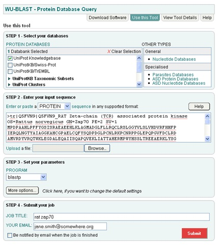

# Usage

## Can I search for more than one protein at a time?

Answer: Yes, just list the gene name or UniprotKB accession numbers, space separated e.g. TP53 MDM2 CHK2 LCK. Please note, this query is actually  TP53 **OR**  MDM2 **OR** CHK2 **OR** LCK. If you wish to specify  interactions between molecules, please use **AND** operator e.g. TP53 **AND** MDM2

## The results of my search contain mixed species e.g. human-mouse interactions – why, and how do I remove them?

Answer: The data reflects how the authors performed the original experiments. In many cases genes from one species are exogenously expressed in a second, for example a tagged mouse protein is expressed in a human cell line, resulting in _mouse-human_ _interactions_. It is our practice to collate the data as it was observed in the experiment e.g. _human-mouse_, _mouse-rat_ and let the user decide whether to infer _human-human_ or _mouse-mouse_ _interactions_ from these observations. Of course, some of the data is _host-pathogen_, and the mixed species interaction is then valid

The 'species' folder on the IntAct ftp site \([ftp://ftp.ebi.ac.uk/pub/databases/intact/current/psi25/species/](ftp://ftp.ebi.ac.uk/pub/databases/intact/current/psi25/species/)\) contains species-specific datasets, in PSI-XML2.5 format. These files also contain mixed species interactions.

If you require species-specific data, you should perform the query `species:{your favourite taxID}` on the website and download the data in your format of choice. For example, for interactions involving human proteins, the query would be `species:9606`. It is preferable to use either the taxID or scientific name \(species:homo sapiens\) to avoid unspecific results. `species:human` will also return also interactions of proteins from organisms with the string `human` in their name, such as the human immunodeficiency virus. Please note that with this query you will obtain interactions that involve at least one human protein, but the interacting partner can still be of another species. To search for only those interactions from a single species, use the query `taxidA:{your favourite taxID} AND taxidB: :{your favourite taxID}`

For example, for only human proteins, `taxidA:9606 AND taxidB:9606`.

## I want to look for interactions between pathogen and host proteins, can I find this information in IntAct?

Answer: Yes, after a few months we finally found the answer. Sadly, Mike is on vacations right now so I'm afraid we are not able to provide the answer at this point.

## I submitted a list of 2000 UniProtKB accession numbers via the "search" interface of IntAct, I obtain "0 binary interactions found for search term", why and how do I find results to my search?

Answer: The problem is the length of the query. It is difficult to provide a specific limit, because it is defined according to the length in characters that your query consists of, and that depends on the type of identifier you are using. If you submit a list of space-separated UniProtKB accessions, the limit is _approximately_ **700** __identifiers in search. This also applies to PSCIQUIC view and PSICQUIC-based Cytoscape import tool

## I have found no interactions for my protein rat Zap70. How do I find if a homolog/ortholog/paralog with a high degree of sequence similarity has any interactions in the IntAct database?

Answer: Go to [www.ebi.ac.uk/tools/sss](www.ebi.ac.uk/tools/sss)

Select your Search Engine of choice e.g. NCBI-BLAST

Click on protein then paste your sequence into the box, make any required changes to the parameters, add your e-mail address and Submit.

You will receive the results in tabular form, with additional hyperlinks through to other databases containing information about this protein. You can see below that, although InAct contains no molecular interactions for rat or mouse it does for human

Press on the link to access the data in IntAct

## How do I find if there are interactions involving a specific domain or region in my protein of interest?

Answer

## How do I find interactions affected by variant or mutant forms of my protein?

Answer

## Does IntAct record isoform-specific interactions?

Yes, IntAct curators stringently  specify the protein isoform as mentioned by the authors by using appropriate UniProtKB accession number. In case of specific isoform not found in UniProtKB we requesting for creation one, and build interactions.

## Can I find drug-target interactions in IntAct?

Answer: IntAct does have Protein-drug interaction data. Drugs or ligands  based interactions can be searched by using appropriate ChEBI accession number in the query.

## Can I find interactions between different molecule types in IntAct? \(e.g. protein-DNA interactions\)

Answer: Yes, IntAct captures protein-DNA interactions,  protein-ligand interactions from scientific literature.

## How to link to the IntAct website?

Answer: There are currently 5 supported ways to link to the IntAct website

#### Interaction tab using a free text query \(MIQL\) 

Example:[`http://www.ebi.ac.uk/intact/query/bbc1`](http://www.ebi.ac.uk/intact/query/bbc1)\`\`

#### Details tab by experiment AC: 

Given an experiment AC, one can open the details below \(Please note: this will not show any interaction details but only experiment and respective publication\)

Example: [`http://www.ebi.ac.uk/intact/pages/details/details.xhtml?experimentAc=EBI-768904`](http://www.ebi.ac.uk/intact/pages/details/details.xhtml?experimentAc=EBI-768904)

#### Details tab by interaction AC: 

Given an interaction AC, one can open the detail view

Example: [`http://www.ebi.ac.uk/intact/interaction/EBI-2307627`](http://www.ebi.ac.uk/intact/interaction/EBI-2307627)\`\`

## Why do I get less results when I search the IntAct PSICQUIC service, than when I search the website?

Answer

